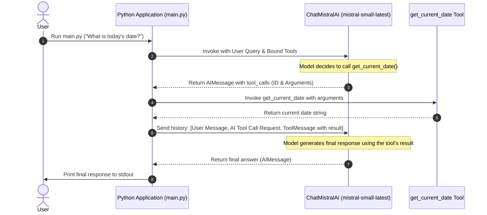

# Mistral Tool Calling Demo with LangChain

This project demonstrates how to implement **Tool Calling** (Function Calling) using the **Mistral AI** models and **LangChain** in Python. 

Tool calling allows Large Language Models (LLMs) to interact with external tools, APIs, or custom Python code to perform tasks they cannot do natively, such as fetching real-time data, performing complex calculations, or interacting with a database.

---

## 🏗️ Architecture & Workflow

Here is a sequence diagram illustrating how tool calling is handled in this project:



---

## 🚀 Getting Started

### 📋 Prerequisites
- Python 3.10+
- A Mistral AI API Key (Get it from [La Plateforme](https://console.mistral.ai/))

### 🔧 Installation & Setup

1. **Clone the repository:**
   ```bash
   git clone https://github.com/hsachan295-source/mistral-tool-calling-demo.git
   cd mistral-tool-calling-demo
   ```

2. **Create and activate a virtual environment:**
   ```bash
   # On Windows
   python -m venv venv
   venv\Scripts\activate

   # On macOS/Linux
   python3 -m venv venv
   source venv/bin/activate
   ```

3. **Install the dependencies:**
   ```bash
   pip install langchain-mistralai python-dotenv
   ```

4. **Configure environment variables:**
   Create a `.env` file in the root directory and add your Mistral API Key:
   ```env
   MISTRAL_API_KEY=your_mistral_api_key_here
   ```

### 🏃 Running the Application

Execute the script to see tool calling in action:
```bash
python main.py
```

---

## 🔍 Code Explanation (`main.py`)

Here is a breakdown of how tool calling is implemented in [main.py](file:///d:/Data%20science%20course/12-Generative%20AI/Module-5/main.py):

1. **Define the Tool:**
   We define a simple tool using LangChain's `@tool` decorator. The docstring describes what the tool does, which is critical because the LLM reads it to determine when to call the tool.
   ```python
   @tool
   def get_current_date():
       '''Use this Tool for getting the current date.'''
       return str(date.today())
   ```

2. **Bind the Tool to the Model:**
   We bind the tool to the ChatMistralAI model instance, allowing the model to know this tool is available.
   ```python
   model = ChatMistralAI(model="mistral-small-latest").bind_tools([get_current_date])
   ```

3. **First Model Invocation:**
   The model is invoked with a query asking for the current date. Because it doesn't know the current date natively, it generates a `tool_calls` request in the response instead of standard text content.
   ```python
   response = model.invoke("What is today's date?")
   ```

4. **Execute the Tool:**
   We invoke the tool using the arguments determined by the model and package the result in a `ToolMessage` linked by the unique tool call ID.
   ```python
   tool_result = get_current_date.invoke(response.tool_calls[0]['args'])
   tool_message = ToolMessage(
       content=tool_result,
       tool_call_id=response.tool_calls[0]["id"]
   )
   ```

5. **Second Model Invocation:**
   We pass the entire conversation history (User query, AI tool call request, and the tool's result message) back to the model. The model reads the tool's output and generates the final natural language answer.
   ```python
   second_response = model.invoke([
       HumanMessage("What is today's date?"),
       response,
       tool_message
   ])
   print(second_response.text)
   ```
